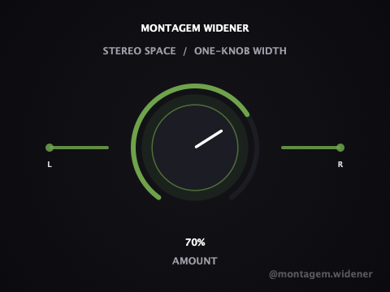

# Montagem Widener

**A one-knob stereo widener, companion plugin to [Montagem Finisher](https://github.com/nabsei/montagem-finisher).**

Turn the single `Amount` knob to open up the stereo image — bass-protected,
so an 808/sub stays solid in mono while the top end gets wider and more
spacious. Built with [JUCE](https://juce.com/), ships as VST3 / AU /
Standalone on macOS and Windows.

<p align="center">
  
</p>

<p align="center">
  <strong><a href="https://github.com/nabsei/montagem-widener/releases/latest">⬇ Download the latest beta</a></strong> — macOS and Windows, free.
</p>

<p align="center">
  Also listed on <a href="https://www.kvraudio.com/product/montagem-widener-by-montagem">KVR Audio</a>.
</p>

## Why one knob

Same philosophy as Montagem Finisher: one macro parameter, no configuration.
`Amount` drives mid-side width and a short Haas delay together, so there's
nothing to misconfigure and nothing that can accidentally smear the bass.

## Status

Early-stage / actively developed public beta.

This repository shows the plugin's **architecture**: JUCE plugin wrapper,
custom UI, parameter handling, state save/load. The exact DSP calibration
used in the shipped/tested build (crossover frequency, gain curve, delay
timing) is simplified in `Source/WidenerProcessor.cpp` here — that tuning
is the actual product, not open source at this stage.

## Features

- Single macro parameter (`Amount`) driving mid-side width + a short Haas delay
- **Bass-protected by design**: content below the width crossover passes
  through unmodified — verified in testing that L/R difference on a pure
  bass signal stays exactly zero regardless of `Amount`
- Custom dark-themed UI matching the Montagem Finisher brand identity: two
  L/R bars grow apart as the knob turns, red (narrow) to green (wide)
- Denormal-safe processing and parameter smoothing (no zipper noise)
- Builds as **VST3**, **AU** (passes `auval` validation), and a **Standalone** app

## Tech stack

- C++17, [JUCE](https://github.com/juce-framework/JUCE) (audio processing + UI)
- CMake + Ninja

## Building

```bash
git clone --depth 1 https://github.com/juce-framework/JUCE.git libs/JUCE
cmake -B build -G Ninja -DCMAKE_BUILD_TYPE=Release
cmake --build build
```

On macOS, add `-DCMAKE_OSX_ARCHITECTURES="arm64;x86_64"` to the configure step
to build a universal binary (Apple Silicon + Intel) instead of the host-only
default. The official beta releases are built this way.

## Project structure

```
Source/
  PluginEntry.cpp        JUCE plugin entry point
  WidenerProcessor.*      AudioProcessor: parameters, DSP, state save/load
  PluginEditor.*           Custom UI (rotary knob, L/R width visual, layout)
  WidenerLookAndFeel.h     Custom LookAndFeel for the rotary control
CMakeLists.txt
```

## Open items

- [ ] Code signing / notarization for both macOS and Windows (current
      beta requires a one-time manual step on first install)
- [ ] Automated test suite

## License

**This repository's source code:** MIT — see [LICENSE](LICENSE). Covers
the architecture shown here (JUCE plugin wrapper, UI, build setup). As
noted above, the DSP calibration used in the actual product is not
included in this source.

**The compiled plugin (downloads / releases):** All rights reserved —
free to use, not free to redistribute or resell. See the `TERMS.txt`
included in each release download for the full terms.
